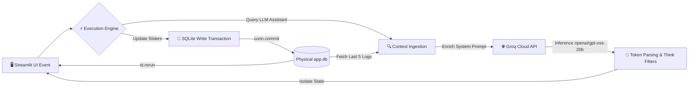

# 🗺️ Smart City Cluj-Napoca — Aplicație Operațională & Workflow Logic

Acest document descrie circuitul logic, tranzacțional și computațional real al platformei Smart City. Structura urmează cu strictețe principiul separării responsabilităților (Separation of Concerns), izolând fluxurile de date pentru a garanta integritatea locală și execuția deterministă.

---

## 🔁 1. Pipeline-ul Tranzacțional de Date (IoT Ingestion Flow)

La fiecare ciclu operațional sau lansare a platformei, datele urmează un traseu liniar, asigurat de bariere de control statice și criptografice în timp constant:

```mermaid
gantt
    title Circuitul Secvențial al Datelor IoT
    dateFormat  X
    axisFormat %s

    section Ingestie & Validare
    Inițializare Context (.env / Structură) :active, p1, 0, 10
    Scaffolding Bază de Date (CityRepository)  :p2, after p1, 15

    section Securitate & Audit
    Barieră Autentificare Operator (MD5/Constant-Time) :crit, p3, after p2, 20
    Evaluare Praguri Alerte & Cooldown 10s   :p4, after p3, 15
    Ingestie security_alerts.log            :p5, after p4, 10

    section Randare & AI
    Calcul Matrice Pearson & Extrapolare ML  :p6, after p5, 15
    Context-Aware Grounding (Inference LLM)  :p7, after p6, 20
```

### Detalii Computaționale pe Etape:

1. **Scaffolding Dinamic (`main.py` -> `CityRepository.initialize_database`):**
   Aplicația verifică existența fișierului `app.db`. Dacă fișierul lipsește sau este gol, clasa de persistență instanțiază automat instrucțiuni SQL DDL de tip `CREATE TABLE IF NOT EXISTS`, generând structurile pentru `sensors`, `city_stats` și `settings`. Se mapează precis cele 5 limite operaționale per nod, asigurând compatibilitatea structurală deplină cu scriptul `seed_db.py`.

2. **Intercepție Criptografică Sincronă (`AuthenticationService.verify_credentials`):**
   Între textul introdus în interfața grafică Streamlit și hash-ul securizat stocat în fișierul local `.env` (`PLATFORM_ADMIN_PASS`) se interpune motorul nativ `hashlib`. Textul clar introdus de operator este transformat instant în amprentă digitală hexazecimală prin algoritmul MD5. Validarea finală se execută prin funcția `hmac.compare_digest` în timp constant, blocând complet atacurile cibernetice de tip timing side-channel (analiză de timp).

3. **Filtru Anti-Duplicare și Audit local:**
   Valorile telemetrice live sunt evaluate în raport cu pragurile stocate în baza de date SQLite. Dacă o valoare depășește limita, sistemul de alerte interceptează pachetul, validează bariera temporală de 10 secunde cooldown anti-spam și append-uieste evenimentul de securitate în fișierul fizic `security_alerts.log`.

---

## 🧠 2. Ciclul de Viață al unei Cereri de Utilizator (User Request Lifecycle)

Atunci când un operator modifică parametrii din interfața grafică sau interoghează Asistentul Urban AI, platforma execută următorul circuit logic decuplat:

### Workflow-ul de Intervenție AI & Guardrails:

* **Context-Aware Grounding (Ancorare Contextuală):**
  Atunci când asistentul inteligent din `app/ai/` pregătește un răspuns, el preia șablonul strict de instrucțiuni din `ai_tests/prompts.txt`, extrage dinamic limba activă din sesiune și accesează direct registrul de traduceri prin `provider_instance._REGISTRY[st.session_state["lang"]]`. Promptul final este îmbogățit cu ultimele 5 înregistrări logate pe disc, oferind modelului o conștientizare deplină a incidentelor din Cluj-Napoca.

* **State Isolation (Izolarea Stării):**
  Rezultatele analizei returnate de API-ul Groq pentru modelul target `openai/gpt-oss-20b` sunt filtrate prin expresii regulate (regex) avansate pentru a elimina blocurile de gândire internă (`<think>...</think>`). Răspunsul curat este stocat în `st.session_state`. Acest lucru izolează datele generative în raport cu bucla automată de reîmprospătare (auto-refresh) a ecranului specifică Streamlit, eliminând complet efectul de pâlpâire sau pierderea datelor din ferestrele de chat.

* **Modernized Layout Constraints:**
  Pentru a garanta o experiență vizuală fluidă, toate butoanele și elementele din pagini folosesc exclusiv noul standard arhitectural nativ Streamlit (cum ar fi parametrul `use_container_width=True` sau containerele stretch), eliminând complet elementele legacy sau avertismentele (warnings) din consolă.
