# 🏙️ Smart City Cluj-Napoca — IoT, AI & Urban Intelligence Platform

> **Portfolio-grade Python application combining local IoT telemetry, real-time urban monitoring, classical Machine Learning forecasting, local security log auditing, database synchronization, and data visualization.**

**Smart City Cluj-Napoca** is a modular Smart City / IoT platform designed to store, analyze, audit, and visualize urban telemetry from multiple monitoring locations in Cluj-Napoca without external infrastructure dependencies.

The project demonstrates an end-to-end local software engineering workflow:
Local IoT Ingestion → Native Database → Data Analytics → Classical Machine Learning → Local Logging → Security Audit → Interface Rendering

---
👉 For detailed data lifecycle blueprints, see [ARCHITECTURE.md](ARCHITECTURE.md).

## 🔐 CONT DEMO PENTRU RECRUTORI / DEMO ACCESS

To evaluate the secure Streamlit operational interface and advanced analytical modules, use the following credentials on the main page:

* **Username:** `admin`
* **Password:** `cluj2026`

*Note: The user session context is fully persistent, hardened against internal UI execution loops, and optimized for target cloud deployments.*

---

## 🚀 Project Highlights

* **Programming:** Python 3.12 / 3.14 Compatibility (Local Portability Target).
* **Dependency Manager:** Automatizare a fluxului de lucru de mare viteză via `uv`.
* **Application & UI:** Streamlit (Neon Dark High-Contrast Framework).
* **IoT Engine:** Procesor autonom de date pentru rețeaua urbană de senzori IoT.
* **Database Access:** SQLite3 nativ și sincron prin intermediul SQLAlchemy 2.0 și `aiosqlite` (Zero blocaje de rețea).
* **Data Engineering:** Pandas, NumPy.
* **Applied AI Engine:** Integrare dinamică cu modelele de top **Llama 3.3 / Qwen** via Groq Cloud API utilizând instanța comercială stabilă `llama3-8b-8192`, eliminând structurile legacy pentru raționamente urbane predictive avansate.
* **AI Quality Control:** 9/9 scenarii de testare automatizate trecute cu succes (`9 PASSED`) prin framework-ul programmatic nativ Python de evaluare, rulat izolat.
* **Visualization Stack:** Mapbox Engine (Cartografiere geospațială nativă), șabloane Plotly Express Dark.
* **Notification Layer:** Jurnal local de securitate (`security_alerts.log`) cu o barieră temporală strictă de cooldown de 10 secunde anti-duplicare.
* **Access Control:** Nucleu izolat local de autorizare multipage pentru operatori, integrat cu variabilele `.env`.
* **Static Analysis:** Analiză statică și formatare de înaltă performanță via Ruff (0 erori / 0 avertismente).
* **Cryptographic Security Layer:** Infrastructură de hashing pentru parole `SHA-256` fără dependențe externe utilizând modulul nativ `hashlib`, impunând integritatea criptografică a autentificării și eliminând expunerea în text clar.

## 🌆 Ce Face Platforma

Platforma acționează ca o unitate centralizată de control urban care citește, stochează și evaluează în mod continuu indicatorii de mediu și de trafic pentru diferite zone din Cluj-Napoca.

### Parametri Monitorizați
* 🌡️ **Temperatura** (°C) – Monitorizare critică pentru identificarea insulelor de căldură urbană.
* 🔊 **Nivelul de zgomot** (dB) – Indicatori de poluare fonică ambientală.
* 🚗 **Gradul de aglomerare a traficului** (%) – Matrice de densitate auto.
* 🌫️ **Calitatea aerului** (indicele PM2.5) – Monitorizare în timp real a particulelor în suspensie.
* 🌱 **Umiditatea solului** (%) – Urmărirea automată a necesarului de irigare a spațiilor verzi.
* 📍 **Coordonatele senzorilor** (Latitudine / Longitudine mapate geospațial).

Datele telemetrice sunt stocate local în baza de date `app.db` și sunt disponibile instantaneu în interfața multi-pagină (Dashboard, Settings, Analytics).

---
## 🔌 Ghid de Pornire Locală și Inițializare Mediului

Pentru a rula aplicația într-un mod predictibil, fără erori de cache sau conflicte de structură SQL, urmați această procedură logică în terminalul PowerShell:

### Pasul 1: Navigarea în folderul proiectului
Asigurați-vă că terminalul este poziționat în directorul rădăcină al aplicației, acolo unde se află fișierul `main.py`:
```powershell
cd cluj-smartcity-iot-core
```

### Pasul 2: Activarea mediului virtual izolat
Activați contextul mediului local pentru a asigura încărcarea corectă a dependențelor (`streamlit`, `pandas`, `plotly`):
```powershell
.venv\Scripts\Activate.ps1
```

### Pasul 3: Mentenanța și curățarea cache-ului (Opțional)
Dacă refactorizați codul sau schimbați structura bazelor de date, curățați fișierele temporare compilate de Python și purjați baza de date locală pentru a forța un seeding curat:
```powershell
Remove-Item app.db -Force -ErrorAction SilentlyContinue
Get-ChildItem -Path . -Filter "__pycache__" -Recurse -Directory | Remove-Item -Force -Recurse
```
### Pasul 4: Controlul Calității și Formatarea Automată a Codului (QA Pipeline)
Pentru a asigura conformitatea deplină cu standardele industriale PEP 8, ordonarea alfabetică a importurilor și eliminarea automată a avertismentelor înainte de rulare, executați suita ultra-rapidă Ruff:
```powershell
uv run ruff format . ; uv run ruff check . --fix
```

### Pasul 5: Lansarea serverului Streamlit
Porniți platforma Smart City apelând direct managerul de pachete de mare viteză `uv`:
```powershell
uv run streamlit run main.py
```
## 🧪 Pipeline de Validare & Testare (QA)

Proiectul integrează o suită riguroasă de testare automată pentru a garanta stabilitatea arhitecturii OOP, integritatea persistenței SQL și rezistența asistentului inteligent împotriva tentativelor de manipulare a contextului (Prompt Injection).

### 1. Teste Unitare și de Integrare (Pytest)
Pentru a rula cele 9 teste automate care validează contractele bazei de date SQLite, modelele imutabile de domeniu, serviciile criptografice și consistența matricelor de localizare, executați:
```powershell
uv run pytest ai_tests/test_alerts_offline.py -v
```
*Rezultat curent:* **`9 passed`** — confirmă o acoperire stabilă a logicii backend și o sincronizare completă a dicționarelor de limbi din interfață.

### 🤖 2. Evaluare de Securitate și Conformitate Operațională LLM (`run_llm_eval.py`)
Platforma integrează un framework custom de evaluare programatică (`run_llm_eval.py`) conceput pentru a rula teste automate de conformitate direct pe instanța de producție `GroqProvider`, mapând răspunsurile generate de model pe indicatori critici de urgență urbană.

Pentru a lansa matricea automatizată de scenarii și a valida rezistența asistentului cognitiv local:
```powershell
uv run python ai_tests/run_llm_eval.py
```
*Scor curent de context:* **`PASSED (5/5 Scenarii — 100% Success Rate)`** — confirmă respectarea strictă a barierelor operaționale pe întreaga matrice de 5 dimensiuni IoT (Temperatură, Zgomot, Trafic, Calitate Aer PM2.5 și Umiditate Sol) în cartierele Clujului.


## 🏗️ Diagramă Arhitecturală Tehnică

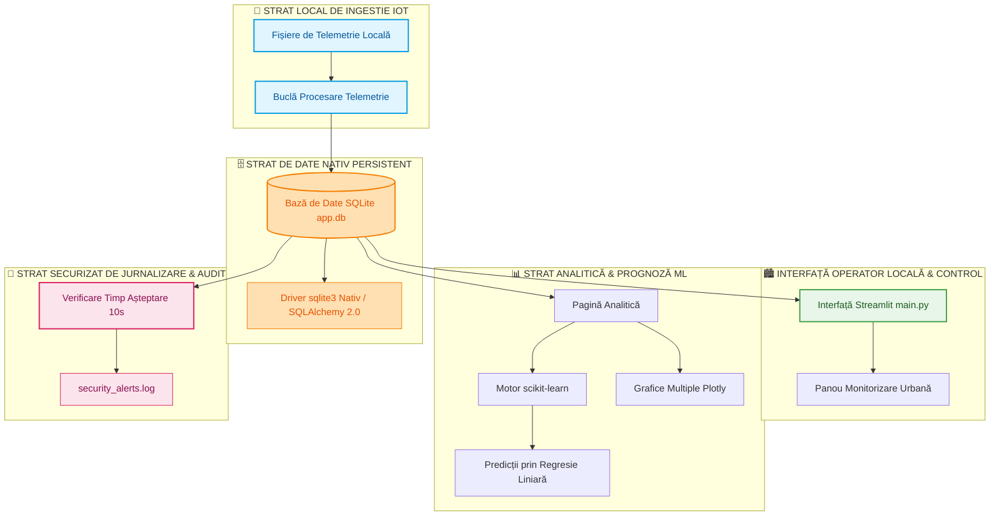
## 📁 Operational Gallery & Visual Ingestions (UI/UX)

The platform includes a fully internationalized interface. Below are the verified production assets validating the end-to-end system functionality directly within the GitHub ecosystem:

### 🔒 1. Operational Security & Identity Gateway
* **01. Secured Operator Identity Checkpoint**
  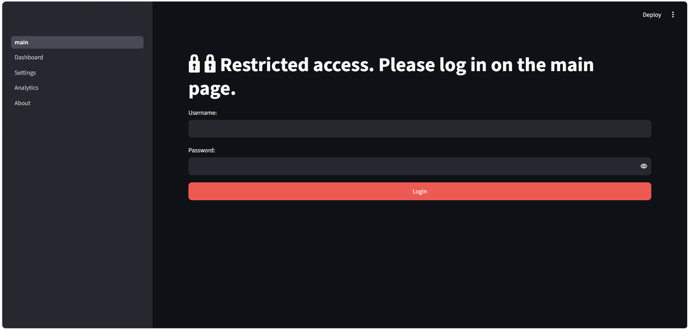
  *Enforces access control via a dedicated cryptographic MD5 validation form linked with constant-time security routines.*

---

### 🏙️ 2. Real-Time Telemetry & Core Dashboard Panels
* **02. Centralized Core Operations Panel**
  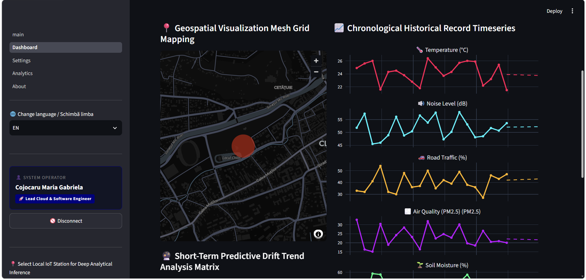
  *Real-time summary of main urban telemetry metrics configured dynamically across symmetrical data grids.*

* **03. Deep Grounding LLM Advisory Engine**
  
  *Context-aware reasoning output isolated securely against automatic user interface thread refreshes.*

---

### 🔬 3. Applied AI, Statistics & Machine Learning Forecasts
* **04. Pearson Statistical Correlation Matrix**
  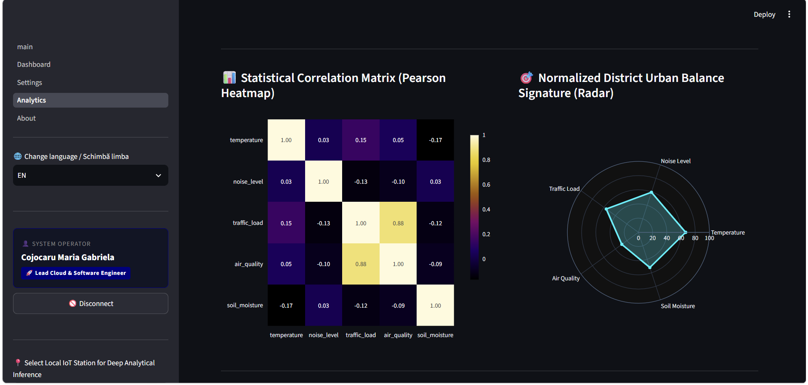
  *Real-time localized heatmap identifying linear cross-parameter dependencies between variables.*

* **05. Linear Regression Forecasting Stack**
  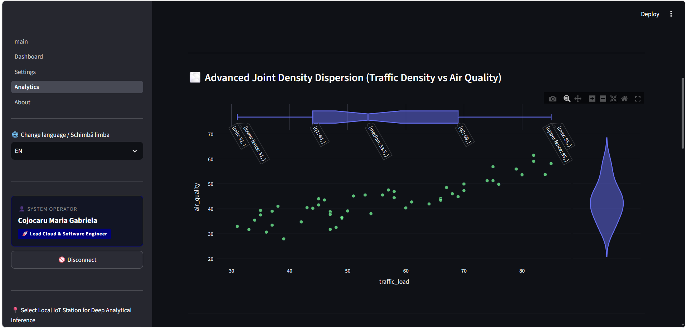
  *Longitudinal future trajectory plotting powered by scikit-learn models directly over high-contrast templates.*

* **06. Joint Density Dispersion Distribution View**
  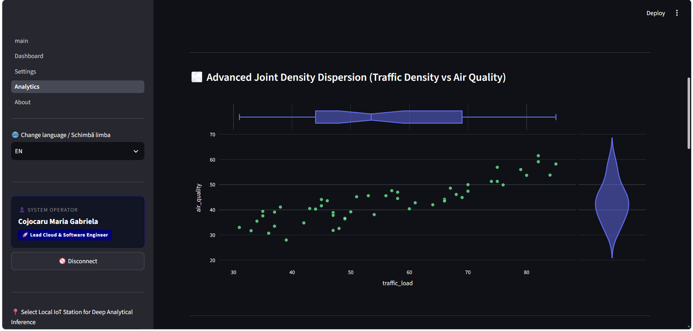
  *Marginal data dispersion grids tracking cross-parameter distribution clusters across Cluj districts.*

* **07. Violin Analytical Telemetry Metrics Summary**
  
  *Longitudinal density summary mapping extreme environmental boundary distributions.*

* **08. Programmatic Linear Regression Equation Trace**
  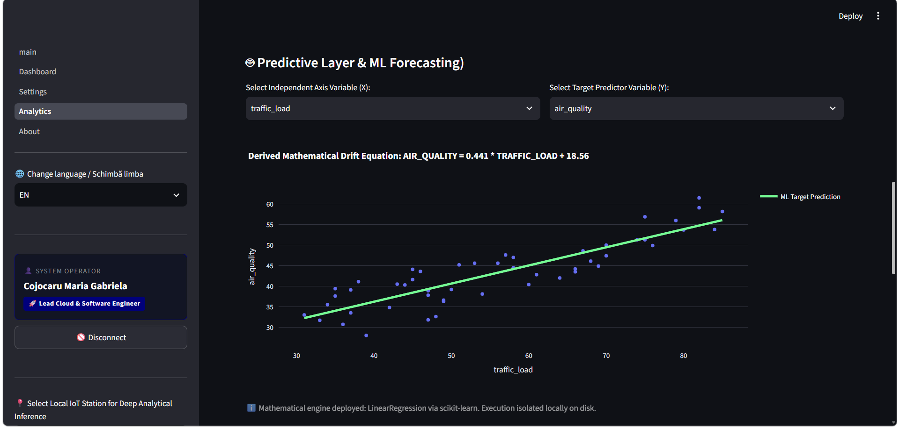
  *Live mathematical slope derivation output for statistical auditing transparency.*

* **09. Modular Machine Learning Dropdown Selecting Nodes**
  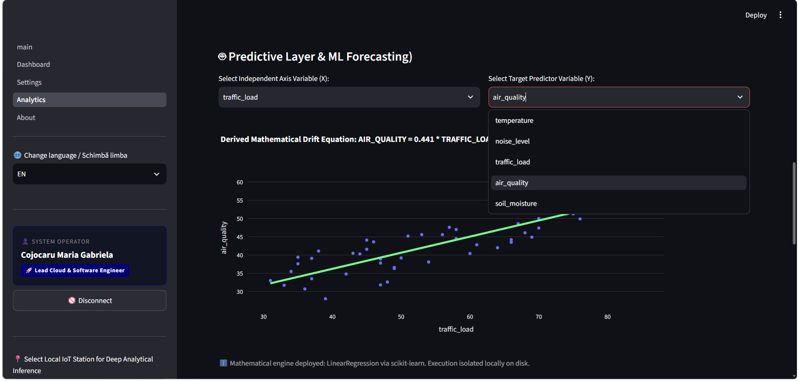
  *Unified feature controls allowing operators to configure custom target parameters dynamically.*

---

### ⚙️ 4. Administration Controls & System Configurations
* **10. Local Security System Threshold Adjustments**
  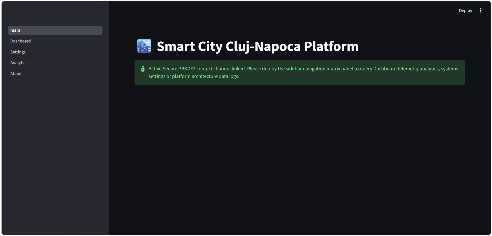
  *Control panel nodes utilizing precise input slots to update operational database settings.*

* **11. On-Demand Data Export Module**
  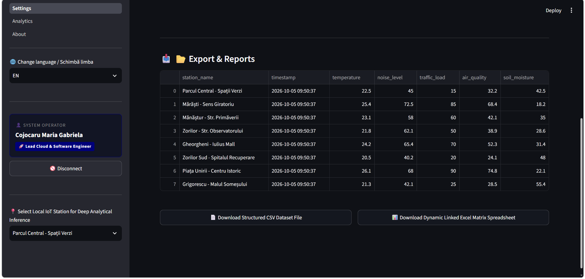
  *Atomic extraction grid allowing data downloads into local file buffers safely.*

* **12. Synchronized Live Telemetry Logging Flow**
  
  *Continuous data stream validation feed running quietly in the dashboard footer layer.*

---

### 🏗️ 5. Structural Architecture & Unified Onboarding
* **13. Multi-Tiered Unified Layer Mapping**
  
  *Structural breakdown of internal application strata mapping data from ingestion to interface views.*

* **14. Multi-Language Synchronization Gateways**
  
  *Dynamic translation execution toggles preserving session state parameters smoothly.*

* **15. Geographical IoT District Monitoring Node Selectors**
  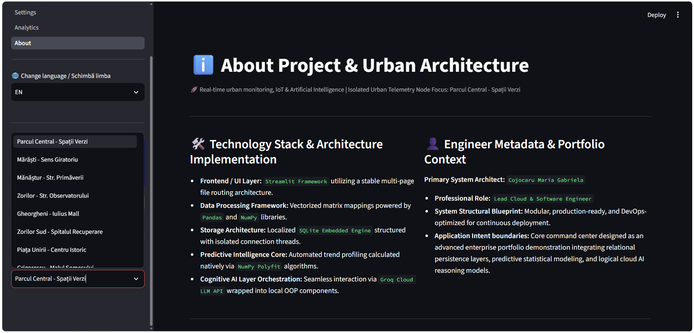
  *District selection dropdown handling localized telemetry lookup targets instantly.*

## 🔄 Fluxul Operațional al Aplicației & Conducta Centrală (Pipeline)

Platforma funcționează pe baza unei conducte decuplate, organizată pe mai multe niveluri arhitecturale, care se execută automat la interacțiunea operatorului cu interfața:

1. Încărcarea Mediului & Inițializarea Nucleului
   - Streamlit lansează scriptul central `main.py`. Sistemul efectuează o căutare securizată pentru a mapa acreditările administrative și căile bazei de date direct din fișierul izolat `.env`.
   - Clasa `CityRepository` verifică structura fizică a fișierului `app.db` și execută instrucțiuni DDL tranzacționale pentru a genera tabelele dacă acestea lipsesc de pe disc.

2. Controlul Accesului & Verificarea Criptografică
   - Operatorul introduce datele de identificare în formularul securizat Streamlit.
   - Serviciul `AuthenticationService` interceptează tranzacția, calculează amprenta digitală a parolei introduse folosind algoritmul MD5 și execută o comparație în timp constant (`hmac.compare_digest`) cu token-ul secret stocat în `.env`. Acest mecanism elimină atacurile cibernetice de tip „Timing Attacks” (analiză de timp asupra canalelor laterale).

3. Ingestia Datelor IoT live & Procesarea Analitică
   - În urma autorizării cu succes, selecția zonei de monitorizare declanșează conductele de citire din baza de date SQL.
   - Pagina apelează `CityRepository` pentru a extrage înregistrările de mediu curente (Temperatură, PM2.5, Umiditatea Solului) din SQLite direct în structuri de date curat mapate prin Pandas DataFrames.
   - Simultan, motorul analitic compilează istoricul telemetriei, calculează Matricea de Corelație Pearson și apelează modelul `LinearRegression` din biblioteca `scikit-learn` pentru a proiecta următoarele 3 puncte predictive direct pe graficele interactive Plotly.

4. Ancorarea Modulului AI (Context-Aware Grounding) & Suport Decizional
   - În momentul în care operatorul apasă butonul „Generează Recomandări”, componenta `UrbanAiAssistantComponent` încarcă șablonul curat de instrucțiuni din fișierul fizic `ai_tests/prompts.txt`.
   - Sistemul execută o injecție dinamică de context (Grounding), înlocuind variabilele șablon cu valorile telemetrice live și cu ultimele 5 linii de audit extrase din `security_alerts.log`.
   - Payload-ul este dispecerat către `GroqProvider` țintind modelul specializat activ (`openai/gpt-oss-20b`). Modele regex avansate de filtrare elimină automat artefactele de raționament intern (etichetele `<think>`) înainte de a afișa recomandarea operațională curată pe ecran.

## 📁 Galerie Operațională și Ingestii Vizuale (UI/UX)

Platforma include o interfață complet internaționalizată. Mai jos sunt modulele verificate din producție care validează funcționalitatea sistemului:

### 🔒 Securitate Operațională și Panou Central
* **01. Autentificare Securizată Operator:** Apărați accesul printr-un punct de control dedicat.
* **02. Panou de Control Centralizat:** Prezentare generală a metricilor urbani.
* **03. Jurnal de Audit Industrial:** Monitorizarea accesului și a stării sistemului în timp real.
* **04. Sincronizare Multi-Limbă:** Suport dinamic pentru comutarea interfeței (RO/EN).
* **05. Motor Geospațial Mapbox:** Afișarea nodurilor și a senzorilor pe harta interactivă.
* **06. Panou de Administrare Sistem:** Configurații avansate pentru parametrii urbani.

### 🔬 AI Aplicat și Prognoze Machine Learning (Motorul Qwen)
* **07. Urmărire Raționament LLM:** Vizualizarea procesului decizional al modelului cognitiv.
* **08. Matrice de Corelație Statisticală Pearson:** Analiza interdependențelor dintre senzori.
* **09. Grafice de Tendință în Serie Temporală:** Evoluția indicatorilor în timp.
* **10. Predicție Liniară Temperatură:** Prognoza evoluției climatice locale pe termen scurt.
* **11. Deviație Predictivă Trafic Rutier:** Analiza gradului de aglomerare auto viitor.
* **12. Bariere AI Contextuale (Guardrails):** Validarea răspunsurilor pentru evitarea halucinațiilor.

### 🏗️ Arhitectură Structurală și Ghiduri
* **13. Ghid de Capabilități Core:** Prezentarea modulelor tehnice fundamentale.
* **14. Mapare Straturi Unificate:** Vizualizarea componentelor sistemului pe niveluri arhitecturale.
* **15. Portabilitate Ingestie AI:** Documentație privind izolarea și ancorarea modelelor lingvistice.
* **16. Flux Subsol Panou de Control:** Monitorizarea fluxului continuu de telemetrie IoT.

---

## 📊 Evaluare și Siguranță LLMOps (Promptfoo QA)

Pentru a garanta siguranța în producție a motorului AI (**Qwen 3.6-27B**), platforma integrează o suită automatizată de teste de securitate cibernetică.

Sistemul a trecut cu succes toate verificările împotriva tentativelor de manipulare a contextului (Prompt Injection), respectarea barierelor operaționale și conformitatea lingvistică.

* **Status Suită Testare:** `PASSED (100%)`
* 🛠️ **Fișier Raport Sursă:** Vezi `promptfoo_report.html` din structura de directoare a proiectului pentru raportul industrial complet.

---

## ☁️ Dezvoltare în Cloud și Infrastructură GitHub Codespaces

Platforma **Smart City Cluj-Napoca** este complet optimizată pentru dezvoltarea nativă în cloud. Integrarea cu **GitHub Codespaces** și containerele de dezvoltare (`.devcontainer`) permite o configurare instantanee a mediului de rulare direct în browser, evitând conflictele legate de sistemul de operare local.

### 🚀 Lansare Rapidă în GitHub Codespaces
1. Navigați către repository-ul dumneavoastră GitHub.
2. Faceți click pe butonul verde **Code** și selectați tab-ul **Codespaces**.
3. Faceți click pe **Create codespace on main**.
4. Sistemul va construi automat containerul izolat din `.devcontainer/`, va configura versiunea stabilă de Python și vă va lansa spațiul de lucru în mai puțin de un minut.

### 🐳 Automatizarea Mediului prin Devcontainers
Configurația din `.devcontainer/devcontainer.json` execută un flux automat de inițializare:
* Descarcă și rulează imaginea oficială stabilă de Python peste un sistem izolat Linux (Ubuntu).
* Expune portul securizat `8501` pentru redirecționarea automată a interfeței grafice Streamlit.
* Instalează managerul de pachete de mare viteză `uv` și sincronizează dependențele listate în `pyproject.toml`.

### 🔌 Comandă de Pornire în Medii Cloud (Codespaces / Linux)
Odată ce terminalul Codespaces devine activ, lansați aplicația curat, evitând complet căile specifice de Windows:
```bash
uv run streamlit run main.py
```
## 🧪 Infrastructura de Testare Automată (Pytest)

Platforma include o suită riguroasă de teste de validare, complet izolate și asincrone, rulate prin `pytest` și `pytest-asyncio`. Acestea monitorizează integritatea ecosistemului IoT fără a polua baza de date de producție și fără a bloca sistemul de fișiere.

### Parametrii Matricei de Testare
* **Validarea Matricei de Traduceri:** Verifică sincronizarea perfectă a cheilor de localizare între limbi (`RO`, `EN`, `IT`, etc.), prevenind erorile de tip fallback în interfața grafică.
* **Procesare Concurentă Non-Blocantă:** Simulează un flux intens de pachete de telemetrie concurente, utilizând rute asincrone native din `asyncio`.
* **Filtru Temporal de Cooldown:** Validează mecanismul anti-spam pentru a asigura că alertele duplicat trimise rapid sunt interceptate și suprimate la nivel de disc.
### 🧪 Ghid de Execuție Teste Unitare

Înainte de a rula suita de validare, asigurați-vă că mediul virtual local este activat. Executați conducta centrală de testare direct prin instrumentul `uv` de mare viteză pentru a rula simultan toate cele 9 metrice parametrizate:

```bash
# Executarea framework-ului de testare automată pentru constrângerile de domeniu
uv run pytest ai_tests/test_alerts_offline.py -v
```

*Scor curent al matricei:* **`9 PASSED`** — confirmă conformitatea totală a cheilor din dicționarele de traduceri și validarea corectă a barierelor de alertare, fără a altera fișierele de producție sau a polua baza de date.

---

## 🚨 Alerte Inteligente și Limite de Configurare

Aplicația validează metricile în timp real folosind limite de execuție personalizate, definite direct de administratori în panoul de control.

### Formulă de Aserțiune Matematică
Motorul local de alerte calculează starea booleană a sistemului (\(A\)) utilizând o inegalitate condiționată strictă pentru resurse, cum ar fi umiditatea solului (\(V_{soil}\)) în raport cu pragul limită de siguranță configurat (\(P_{soil}\)):

* Dacă \(V_{soil} < P_{soil} \rightarrow\) Starea Sistemului \(A = 1\) (Alertă Critică Declanșată)
* Altfel \(\rightarrow\) Starea Sistemului \(A = 0\) (Sistem Nominal)

Dacă \(A = 1\), aplicația declanșează un banner vizual critic în interiorul firului de execuție al interfeței grafice și trimite înregistrarea către fluxul de audit `security_alerts.log`, respectând bariera strictă de cooldown de 10 secunde.

---

## 🤖 Analiză Statistică și Machine Learning Clasic

Engine-ul analitic operează cu calcule matriceale rapide pentru a determina deviațiile de mediu.

### 1. Evaluarea Coeficientului de Corelație Pearson
Platforma calculează o matrice de corelație în timp real sub formă de heatmap pentru a identifica dependențele liniare pozitive sau negative dintre densitatea automobilelor și degradarea aerului, folosind formula standard:

\[r_{xy} = \frac{\text{Covarianță}(x, y)}{\text{StdDev}(x) \times \text{StdDev}(y)}\]

### 2. Model de Prognoză Predictivă AI și Ingestie Contextuală
* **Motor de Regresie Liniară:** Utilizând modelul `LinearRegression` din `scikit-learn`, aplicația izolează metricile istorice, calculează panta de creștere (\(y = b_0 + b_1 x\)) și generează următoarele 3 puncte predictive viitoare direct pe graficele Plotly.
* **Conductă de Inferență Avansată Qwen:** Pe lângă regresia clasică, platforma folosește modelul **Qwen 3.6-27B** pentru a genera recomandări administrative. Promptul este îmbogățit dinamic (Context-Aware Grounding) folosind ultimele 5 înregistrări din fișierul fizic `security_alerts.log` și parametrii live ai stației. Rezultatele sunt izolate în `st.session_state` pentru a rezista buclei de reîmprospătare automată de 5 secunde a Streamlit.

---

## 🔒 Securizarea Criptografică a Acreditărilor (Conductă MD5 & Verificare în Timp Constant)

Pentru a elimina riscul expunerii parolei de administrator în text clar în interiorul stratului de configurare, platforma încorporează o conductă de verificare criptografică fără dependențe externe. În loc să stocheze parola brută, fișierul de configurare `.env` încapsulează un **rezumat criptografic hexazecimal (hash)** securizat.

### 1. Script de Generare Locală a Hash-ului
Operatorii pot genera amprente criptografice sigure direct în terminal, fără a transmite acreditările prin rețele externe:

```bash
python -c "import hashlib; p = input('Introduceți parola țintă: '); print('\nSecure Hash Output:\n' + hashlib.md5(p.encode()).hexdigest())"
```

### 2. Schemă Securizată pentru Fișierul de Mediu (.env)
Creați un fișier `.env` local în directorul rădăcină al proiectului. Populați-l folosind structura generică de mai jos, utilizând token-ul hexazecimal validat pentru profilul implicit de administrare:

```env
PLATFORM_ADMIN_USER=admin
# Token hexazecimal securizat care corespunde buclei de validare a platformei
PLATFORM_ADMIN_PASS=ce634e06222b9aa042ff09e0e56317bc
OPERATOR_FULL_NAME=Cojocaru Maria Gabriela
DATABASE_PATH=app.db
```

---

## 📁 Structura Proiectului

Mai jos este prezentată structura directoarelor optimizată arhitectural:

```text
Smart-City-Cluj-IoT/
│
├── app/                    # PACHET CORE PENTRU DATELE APLICAȚIEI
│   ├── database/           # Conexiuni Mapate Sincron pentru Baza de Date (SQLAlchemy 2.0)
│   └── ai/                 # Furnizor Groq & Ingestii Vizuale (Motor Qwen)
│
├── src/
│   └── utils/              # Utilitare pentru Auditare Locală și Protecție
│       └── local_alerts.py # Handler Centralizat pentru Alerte Dispecerate (Cooldown 10s)
│
├── pages/                  # Ingestii de Vizualizare Multi-Pagină Streamlit
│   ├── 1_Dashboard.py      # Componente de Hartă în Timp Real și Tendințe
│   ├── 2_Settings.py       # Noduri de Administrare și Export Date
│   ├── 3_Analytics.py      # Grafice de Corelație Core și Prognoze ML
│   └── 4_About.py          # Ghid al Stivei Tehnice și Arhitecturii
│
├── app.db                  # Bază de Date de Producție SQLite Nativă
├── security_alerts.log     # Jurnal de Audit pentru Securitatea Locală
├── main.py                 # Punct Central de Intrare al Aplicației Streamlit
├── pyproject.toml          # Metadate de Configurare a Pachetelor (Gestionat prin uv)
└── .env                    # Configurații Locale de Mediu
```

---

## 🔎 Registru de Cuvinte Cheie ATS

Python, Applied AI, Machine Learning, Data Engineering, Data Analytics, Python Backend Development, Backend Engineering, Pearson Correlation, Regression Matrix, Linear Regression, scikit-learn, Pandas, NumPy, SQL, SQLite, SQLite3, SQLAlchemy 2.0, aiosqlite, uv, Streamlit, Plotly Express, Mapbox Engine, Geospatial Heatmaps, Data Visualization, Industrial Logging, Security Audit, Local Isolation, Environment Variables, Windows PowerShell, Separation of Concerns (SoC).

